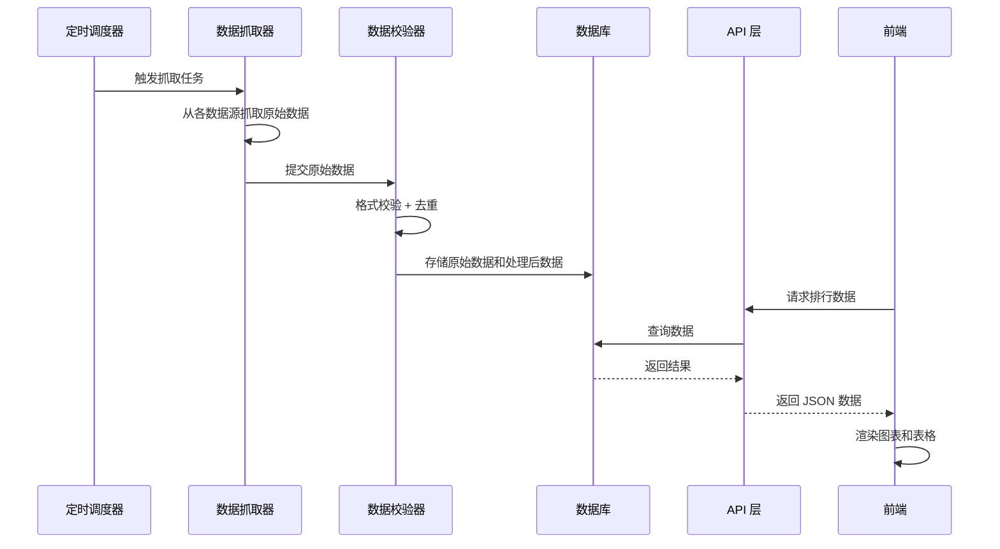

# 设计文档：AI 大模型排行榜

## 概述

本系统是一个全栈 Web 应用，用于展示和对比市面上主流 AI 大模型的评测数据。前端采用 Next.js（React）构建，提供响应式的交互界面；后端使用 Next.js API Routes 提供数据接口；数据抓取模块使用 Node.js 脚本定时从第三方评测平台获取数据；数据存储使用 SQLite（通过 Prisma ORM）以简化部署。

技术选型理由：
- Next.js：SSR/SSG 支持，利于 SEO 和首屏加载性能；API Routes 简化后端开发
- SQLite + Prisma：轻量级数据库，无需额外数据库服务，适合中小规模数据
- Tailwind CSS：快速构建响应式 UI，支持深色模式
- Recharts：React 生态中成熟的图表库，支持雷达图、柱状图、折线图
- node-cron：轻量级定时任务调度

## 架构

```mermaid
graph TB
    subgraph 前端 ["前端 (Next.js Pages)"]
        A[排行榜首页] --> B[模型详情页]
        A --> C[模型对比页]
        A --> D[图表可视化组件]
    end

    subgraph API ["API 层 (Next.js API Routes)"]
        E[/api/models]
        F[/api/rankings]
        G[/api/dimensions]
        H[/api/export]
        I[/api/scraper/trigger]
    end

    subgraph 数据层 ["数据层"]
        J[(SQLite 数据库)]
        K[Prisma ORM]
    end

    subgraph 抓取模块 ["数据抓取模块"]
        L[调度器 node-cron]
        M[LMSYS 抓取器]
        N[OpenLLM 抓取器]
        O[官方数据抓取器]
        P[数据校验器]
    end

    前端 --> API
    API --> K --> J
    L --> M & N & O
    M & N & O --> P --> K
```

### 数据流



## 组件与接口

### 前端组件

#### 页面组件

1. **LeaderboardPage** - 排行榜首页
   - 展示模型数据表格
   - 集成筛选栏、搜索框、维度切换
   - 支持排序和分页

2. **ModelDetailPage** - 模型详情页
   - 展示单个模型的完整评测数据
   - 展示历史评分变化折线图

3. **ComparePage** - 模型对比页
   - 雷达图对比
   - 表格对比

#### 功能组件

1. **RankingTable** - 排行表格组件
   - Props: `models: Model[]`, `dimension: string`, `sortOrder: 'asc' | 'desc'`
   - 支持列排序、前三名高亮

2. **FilterPanel** - 筛选面板组件
   - Props: `onFilterChange: (filters: FilterState) => void`
   - 包含开发商筛选、开源筛选、参数规模范围筛选

3. **SearchBar** - 搜索组件
   - Props: `onSearch: (keyword: string) => void`
   - 实时过滤，防抖处理

4. **DimensionSelector** - 维度选择器
   - Props: `dimensions: Dimension[]`, `selected: string`, `onChange: (dim: string) => void`

5. **RadarChart** - 雷达图组件
   - Props: `models: Model[]`, `dimensions: Dimension[]`

6. **BarChart** - 柱状图组件
   - Props: `models: Model[]`, `dimension: string`

7. **LineChart** - 折线图组件
   - Props: `modelId: string`, `dimension: string`, `history: ScoreHistory[]`

8. **ExportButton** - 数据导出组件
   - Props: `data: Model[]`, `format: 'csv' | 'json'`

### API 接口

```
GET /api/models
  查询参数: vendor?, openSource?, minParams?, maxParams?, search?, dimension?, page?, pageSize?
  响应: { models: Model[], total: number }

GET /api/models/:id
  响应: { model: ModelDetail }

GET /api/rankings
  查询参数: dimension, limit?
  响应: { rankings: RankedModel[] }

GET /api/dimensions
  响应: { dimensions: Dimension[] }

GET /api/export
  查询参数: format ('csv' | 'json'), 与 /api/models 相同的筛选参数
  响应: 文件下载 (CSV 或 JSON)

POST /api/scraper/trigger
  请求体: { source?: string }
  响应: { status: 'started' | 'error', message: string }
```

### 数据抓取器接口

```typescript
interface Scraper {
  name: string;
  source: string;
  scrape(): Promise<RawScrapedData[]>;
}

interface DataValidator {
  validate(data: RawScrapedData[]): ValidatedData[];
  deduplicate(data: ValidatedData[]): ValidatedData[];
}

interface ScraperScheduler {
  register(scraper: Scraper): void;
  start(cronExpression: string): void;
  stop(): void;
  runNow(scraperName?: string): Promise<ScrapeResult>;
}
```

## 数据模型

### Prisma Schema

```prisma
model AIModel {
  id          String   @id @default(cuid())
  name        String   @unique
  vendor      String
  releaseDate DateTime?
  paramSize   String?
  openSource  Boolean  @default(false)
  description String?
  createdAt   DateTime @default(now())
  updatedAt   DateTime @updatedAt

  scores      Score[]
}

model Dimension {
  id          String  @id @default(cuid())
  name        String  @unique
  displayName String
  description String?
  weight      Float   @default(1.0)

  scores      Score[]
}

model Score {
  id          String   @id @default(cuid())
  modelId     String
  dimensionId String
  value       Float
  source      String
  scrapedAt   DateTime @default(now())
  createdAt   DateTime @default(now())

  model       AIModel   @relation(fields: [modelId], references: [id])
  dimension   Dimension @relation(fields: [dimensionId], references: [id])

  @@unique([modelId, dimensionId, source, scrapedAt])
}

model ScrapeLog {
  id        String   @id @default(cuid())
  source    String
  status    String
  rawData   String?
  error     String?
  startedAt DateTime @default(now())
  endedAt   DateTime?
}
```

### TypeScript 类型定义

```typescript
interface Model {
  id: string;
  name: string;
  vendor: string;
  releaseDate: string | null;
  paramSize: string | null;
  openSource: boolean;
  scores: Record<string, number | null>; // dimensionName -> score
}

interface ModelDetail extends Model {
  description: string | null;
  scoreHistory: ScoreHistory[];
}

interface ScoreHistory {
  dimensionName: string;
  value: number;
  source: string;
  scrapedAt: string;
}

interface RankedModel extends Model {
  rank: number;
  dimensionScore: number | null;
}

interface Dimension {
  id: string;
  name: string;
  displayName: string;
  weight: number;
}

interface FilterState {
  vendor: string | null;
  openSource: boolean | null;
  minParams: number | null;
  maxParams: number | null;
  search: string;
}

interface RawScrapedData {
  source: string;
  modelName: string;
  dimensionName: string;
  score: number;
  scrapedAt: Date;
  rawPayload: string;
}

interface ValidatedData extends RawScrapedData {
  normalizedModelName: string;
  normalizedDimensionName: string;
}

interface ScrapeResult {
  source: string;
  status: 'success' | 'partial' | 'error';
  recordsProcessed: number;
  errors: string[];
}

interface ExportMeta {
  exportedAt: string;
  source: string;
  filters: FilterState;
  dataLastUpdated: string;
}
```

### 数据归一化

不同数据源的评分体系不同，需要进行归一化处理：

```typescript
interface ScoreNormalizer {
  normalize(rawScore: number, source: string, dimension: string): number;
}
```

归一化策略：将各数据源的评分映射到 0-100 的统一区间，使用 min-max 归一化方法。每个数据源维护各自的评分范围配置。


## 正确性属性

*正确性属性是指在系统所有有效执行中都应成立的特征或行为——本质上是关于系统应该做什么的形式化陈述。属性是连接人类可读规范和机器可验证正确性保证之间的桥梁。*

### Property 1: 模型展示完整性

*For any* 模型数据，排行表格中该模型的渲染输出应包含所有必需字段：模型名称、开发商、发布日期、参数规模、是否开源，以及该模型所有已有评测维度的评分数据。

**Validates: Requirements 1.2, 1.3**

### Property 2: 维度排序正确性

*For any* 模型列表和任意评测维度，按该维度排序后的结果列表应满足：对于列表中任意相邻的两个模型，前者在该维度的评分应大于或等于后者的评分（降序）。

**Validates: Requirements 2.2**

### Property 3: 加权平均排行正确性

*For any* 模型列表和维度权重配置，综合排行的排序结果应满足：每个模型的综合分等于其各维度评分的加权平均值，且列表按综合分降序排列。

**Validates: Requirements 2.3**

### Property 4: 筛选结果正确性

*For any* 模型数据集和任意单一筛选条件（开发商、是否开源、参数规模范围、搜索关键词），筛选结果中的每个模型都应满足该筛选条件，且数据集中所有满足条件的模型都应出现在结果中。

**Validates: Requirements 3.1, 3.2, 3.3, 3.4**

### Property 5: 筛选条件组合正确性

*For any* 模型数据集和任意多个筛选条件的组合，组合筛选的结果应等于各单一筛选条件分别应用后结果的交集。

**Validates: Requirements 3.5**

### Property 6: 数据校验与去重正确性

*For any* 原始抓取数据集（可能包含重复项和格式错误项），经过校验和去重处理后的结果应满足：无重复记录，且所有记录均通过格式校验。

**Validates: Requirements 4.4**

### Property 7: 错误恢复数据不变性

*For any* 数据库状态，当数据抓取过程发生错误时，数据库中的模型数据和评分数据应与抓取前完全一致。

**Validates: Requirements 4.5**

### Property 8: 原始数据与处理数据双重存储

*For any* 成功的数据抓取操作，系统应同时存储原始抓取数据和经过处理的数据，且两者均可独立查询。

**Validates: Requirements 4.6**

### Property 9: 对比模型数量约束

*For any* 模型选择操作，系统允许的对比模型数量应在 2 至 5 的范围内（含边界值）。少于 2 个或多于 5 个的选择应被拒绝。

**Validates: Requirements 5.1**

### Property 10: 数据导出往返一致性

*For any* 模型数据集和导出格式（CSV 或 JSON），将数据导出后再解析回来应产生与原始数据等价的结果。

**Validates: Requirements 8.1, 8.2**

### Property 11: 导出数据与筛选结果一致性

*For any* 筛选条件和模型数据集，导出的数据应与当前筛选条件下页面展示的数据一致，且导出文件应包含数据来源和抓取时间元信息。

**Validates: Requirements 8.3, 8.4**

## 错误处理

### 数据抓取错误

| 错误场景 | 处理策略 |
|---------|---------|
| 数据源网站不可达 | 记录错误日志，跳过该数据源，继续抓取其他数据源 |
| 数据格式变更 | 记录格式不匹配错误，保留原始响应数据用于调试 |
| 数据校验失败 | 丢弃不合格数据，记录详细校验错误信息 |
| 抓取超时 | 设置 30 秒超时，超时后记录日志并重试一次 |
| 数据库写入失败 | 事务回滚，保留上次成功数据，记录错误日志 |

### API 错误

| 错误场景 | HTTP 状态码 | 响应格式 |
|---------|-----------|---------|
| 模型不存在 | 404 | `{ error: "模型未找到" }` |
| 无效的筛选参数 | 400 | `{ error: "参数错误", details: [...] }` |
| 无效的导出格式 | 400 | `{ error: "不支持的导出格式" }` |
| 服务器内部错误 | 500 | `{ error: "服务器错误" }` |
| 数据库连接失败 | 503 | `{ error: "服务暂时不可用" }` |

### 前端错误

- API 请求失败时展示错误提示，提供重试按钮
- 图表渲染失败时展示降级的表格视图
- 数据加载超时时展示超时提示并建议刷新

## 测试策略

### 测试框架选择

- **单元测试**: Jest + React Testing Library
- **属性测试**: fast-check（JavaScript/TypeScript 生态中成熟的属性测试库）
- **端到端测试**: Playwright（可选，用于关键用户流程）

### 属性测试配置

- 每个属性测试至少运行 100 次迭代
- 每个测试需通过注释引用设计文档中的属性编号
- 标签格式: **Feature: ai-model-leaderboard, Property {number}: {property_text}**
- 每个正确性属性由一个独立的属性测试实现

### 单元测试覆盖

单元测试聚焦于：
- 具体示例和边界情况（如空数据、缺失字段）
- 组件渲染正确性（如前三名高亮、暂无数据标识）
- API 端点的请求/响应格式
- 错误处理路径

### 属性测试覆盖

属性测试聚焦于：
- 排序正确性（Property 2, 3）
- 筛选逻辑正确性（Property 4, 5）
- 数据校验与去重（Property 6）
- 错误恢复不变性（Property 7）
- 数据导出往返一致性（Property 10）
- 导出与筛选一致性（Property 11）

### 测试与实现的关系

- 属性测试和单元测试互为补充
- 单元测试捕获具体的 bug，属性测试验证通用的正确性
- 属性测试应紧跟对应功能的实现，尽早发现问题
