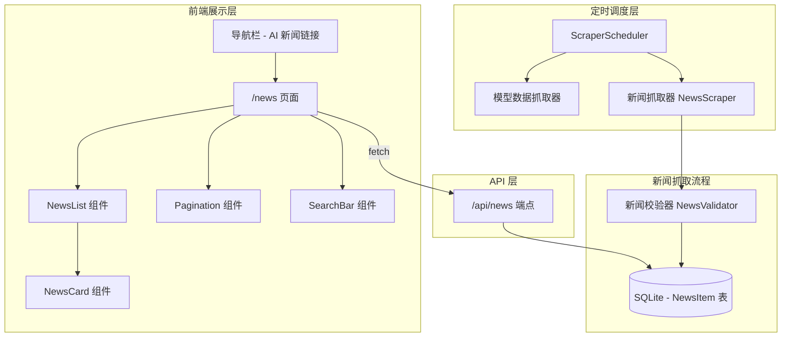

# 设计文档：AI 最新重点新闻 Tab

## 概述

本功能为现有 AI 大模型排行榜网站增加"AI 新闻"Tab，实现从外部新闻源自动抓取、存储和展示 AI 领域重点新闻。设计复用现有的 `ScraperScheduler` 定时调度架构，新增新闻抓取器作为独立数据源注册。前端通过新的 API 端点获取新闻数据，以独立页面 `/news` 展示。

核心设计决策：
- 新闻抓取器实现 `Scraper` 接口的变体（因为新闻数据结构与评分数据不同，需要独立的抓取和存储流程）
- 使用内置新闻数据作为默认数据源（与现有 `BuiltinScraper` 模式一致），后续可扩展为真实 RSS/API 抓取
- 新闻与 AI 模型通过标签关联，而非外键强关联，保持灵活性

## 架构



## 组件与接口

### 1. 新闻抓取器（NewsScraper）

新闻抓取器负责从外部源获取 AI 新闻数据。由于新闻数据结构与现有评分数据不同，新闻抓取器实现独立的 `NewsScraper` 接口，但通过适配器模式注册到现有 `ScraperScheduler`。

```typescript
/** 原始新闻数据 */
interface RawNewsItem {
  title: string;           // 新闻标题
  summary: string;         // 新闻摘要
  sourceName: string;      // 来源名称（如 "TechCrunch"）
  sourceUrl: string;       // 原文链接
  publishedAt: Date;       // 发布时间
  tags: string[];          // 关联标签（AI 模型名称或关键词）
  rawPayload: string;      // 原始数据 JSON
}

/** 新闻抓取器接口 */
interface NewsScraperInterface {
  name: string;
  source: string;
  scrapeNews(): Promise<RawNewsItem[]>;
}
```

### 2. 新闻校验器（NewsValidator）

```typescript
/** 校验后的新闻数据 */
interface ValidatedNewsItem extends RawNewsItem {
  normalizedTitle: string;  // 归一化标题（用于去重）
}

/** 校验函数 */
function validateNews(data: RawNewsItem[]): ValidatedNewsItem[];
function deduplicateNews(data: ValidatedNewsItem[]): ValidatedNewsItem[];
```

校验规则：
- 标题、来源名称、来源链接不能为空
- 来源链接必须是有效 URL 格式
- 发布时间必须是有效日期
- 去重基于 `sourceUrl` 字段

### 3. 新闻 API 端点（`/api/news`）

```typescript
// GET /api/news?page=1&pageSize=20&keyword=GPT
interface NewsApiResponse {
  news: NewsItemResponse[];
  total: number;
  page: number;
  pageSize: number;
}

interface NewsItemResponse {
  id: string;
  title: string;
  summary: string;
  sourceName: string;
  sourceUrl: string;
  publishedAt: string;      // ISO 日期字符串
  tags: string[];
}
```

参数校验：
- `page` 默认 1，必须为正整数
- `pageSize` 默认 20，范围 1-100
- `keyword` 可选，对标题和摘要进行模糊匹配

### 4. 前端组件

#### NewsCard 组件
展示单条新闻，包含标题、摘要、来源标注、发布时间和标签。

#### NewsList 组件
新闻列表容器，管理新闻数据的获取和展示。

#### Pagination 组件
分页导航控件，支持上一页/下一页和页码跳转。

## 数据模型

### Prisma Schema 新增

```prisma
model NewsItem {
  id          String   @id @default(cuid())
  title       String
  summary     String
  sourceName  String
  sourceUrl   String   @unique
  publishedAt DateTime
  tags        String   // JSON 数组字符串，如 '["GPT-4o","OpenAI"]'
  scrapedAt   DateTime @default(now())
  createdAt   DateTime @default(now())
}
```

设计决策说明：
- `sourceUrl` 设为 `@unique`，在数据库层面保证新闻不重复
- `tags` 使用 JSON 字符串存储（SQLite 不支持数组类型），解析在应用层处理
- 不与 `AIModel` 表建立外键关联，因为新闻标签可能包含尚未入库的模型名称或通用关键词

### 类型定义新增

```typescript
/** 新闻条目（前端展示用） */
export interface NewsItem {
  id: string;
  title: string;
  summary: string;
  sourceName: string;
  sourceUrl: string;
  publishedAt: string;
  tags: string[];
}

/** 新闻列表分页响应 */
export interface NewsListResponse {
  news: NewsItem[];
  total: number;
  page: number;
  pageSize: number;
}
```


## 正确性属性

*正确性属性是一种在系统所有有效执行中都应成立的特征或行为——本质上是关于系统应该做什么的形式化陈述。属性是人类可读规范与机器可验证正确性保证之间的桥梁。*

### Property 1: 新闻数据存储 round-trip

*对于任意*有效的新闻数据（包含标题、摘要、来源名称、来源链接、发布时间、标签），存储到数据库后再读取，所有字段的值应与原始数据一致。

**Validates: Requirements 1.1, 1.2**

### Property 2: 来源链接去重不变量

*对于任意*一组新闻数据（可能包含重复的 sourceUrl），经过去重处理后，结果集中不应存在两条具有相同 sourceUrl 的记录，且结果集的大小应等于输入中不同 sourceUrl 的数量。

**Validates: Requirements 1.3**

### Property 3: 发布时间降序排列

*对于任意*新闻查询结果列表，列表中每条新闻的 publishedAt 应大于等于其后一条新闻的 publishedAt。

**Validates: Requirements 1.4, 3.1, 4.2**

### Property 4: 校验过滤有效性

*对于任意*一组原始新闻数据（包含有效和无效记录），校验后的输出应是输入的子集，且输出中每条记录的标题、来源名称、来源链接均为非空字符串，来源链接为有效 URL，发布时间为有效日期。

**Validates: Requirements 2.5**

### Property 5: 分页不变量

*对于任意*有效的 page 和 pageSize 参数，API 返回的新闻数量应不超过 pageSize；且对于连续两页的查询结果，两页的新闻 id 集合不应有交集。

**Validates: Requirements 3.2**

### Property 6: 关键词过滤准确性

*对于任意*关键词搜索查询，返回的每条新闻的标题或摘要中都应包含该关键词（不区分大小写）。

**Validates: Requirements 3.3, 4.8**

### Property 7: 新闻响应字段完整性

*对于任意* API 返回的新闻条目，每条记录都应包含非空的 title、summary、sourceName、sourceUrl 字段，以及有效的 publishedAt 日期字符串和 tags 数组。

**Validates: Requirements 2.4, 3.4**

### Property 8: 新闻卡片渲染信息完整性

*对于任意*新闻数据，渲染后的 NewsCard 组件输出应包含新闻标题文本、摘要文本、来源名称、发布时间，以及所有关联标签。

**Validates: Requirements 4.3, 4.5, 4.9**

## 错误处理

### 抓取层错误处理
- 单个新闻源抓取失败时，记录错误日志到 `ScrapeLog`，继续处理其他新闻源
- 抓取超时（复用现有 `SCRAPER_TIMEOUT_MS = 30s`）时，视为抓取失败
- 校验失败的记录被静默过滤，不中断整体流程

### API 层错误处理
- 无效查询参数（page < 1、pageSize 超出范围）返回 HTTP 400 和错误描述
- 数据库查询异常返回 HTTP 500 和通用错误信息
- 空结果集返回正常 200 响应，`news` 为空数组

### 前端错误处理
- API 请求失败时显示错误提示信息
- 新闻列表为空时显示"暂无新闻"提示
- 图片或链接加载失败时优雅降级

## 测试策略

### 属性测试（Property-Based Testing）

使用 `fast-check` 库（项目已安装）进行属性测试，每个属性至少运行 100 次迭代。

每个正确性属性对应一个独立的属性测试：

1. **Property 1 测试**：生成随机新闻数据，写入数据库后读取，断言字段一致
   - Tag: `Feature: ai-news-tab, Property 1: 新闻数据存储 round-trip`

2. **Property 2 测试**：生成包含重复 sourceUrl 的随机新闻列表，执行去重，断言无重复
   - Tag: `Feature: ai-news-tab, Property 2: 来源链接去重不变量`

3. **Property 3 测试**：生成随机新闻列表并排序，断言降序不变量
   - Tag: `Feature: ai-news-tab, Property 3: 发布时间降序排列`

4. **Property 4 测试**：生成混合有效/无效字段的随机新闻数据，执行校验，断言输出全部有效
   - Tag: `Feature: ai-news-tab, Property 4: 校验过滤有效性`

5. **Property 5 测试**：生成随机新闻数据集，用不同 page 参数查询，断言分页不变量
   - Tag: `Feature: ai-news-tab, Property 5: 分页不变量`

6. **Property 6 测试**：生成随机关键词和新闻数据，执行过滤，断言结果都包含关键词
   - Tag: `Feature: ai-news-tab, Property 6: 关键词过滤准确性`

7. **Property 7 测试**：生成随机 API 响应数据，断言每条记录字段完整
   - Tag: `Feature: ai-news-tab, Property 7: 新闻响应字段完整性`

8. **Property 8 测试**：生成随机新闻数据渲染 NewsCard，断言输出包含所有必要信息
   - Tag: `Feature: ai-news-tab, Property 8: 新闻卡片渲染信息完整性`

### 单元测试

单元测试聚焦于具体示例和边界情况：

- 新闻校验器：空字符串标题、无效 URL、无效日期等边界输入
- API 端点：无效参数返回 400、空结果集、正常分页
- 前端组件：骨架屏加载状态、空列表提示、链接 target="_blank" 属性

### 测试配置

- 属性测试库：`fast-check`（已在项目 node_modules 中）
- 测试框架：`jest`（已配置）
- 每个属性测试最少 100 次迭代
- 每个属性测试必须以注释引用设计文档中的属性编号
